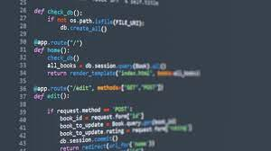

## Build you Home Page here 
This is about your journey. Start now!!!
Go to my [Github account](https://github.com/YeongsuKimm) !!
 

<!-- ## Overview of Hacks, Study and Tangibles
Blogging in GitHub pages is a way to learn and code at the same time. 

- Plans, Lists, [Scrum Boards](https://clickup.com/blog/scrum-board/) help you to track key events, show progress and record time.  Effort is a big part of your class grade.  Show plans and time spent!
- [Hacks(Todo)](https://levelup.gitconnected.com/six-ultimate-daily-hacks-for-every-programmer-60f5f10feae) enable you to stay in focus with key requirements of the class.  Each Hack will produce Tangibles.
- Tangibles or [Tangible Artifacts](https://en.wikipedia.org/wiki/Artifact_(software_development)) are things you accumulate as a learner and coder.  -->

<!-- ## MY PAGE -->

<h2>About Me:</h2>

    
    <ol style="font-size:15px">
        <li>I was born in South Korea</li>
          
        <li>I have a dog   </li>
           
        <li>I like music <h6>My favorite song</h6><iframe width="280" height="157" src="https://www.youtube.com/embed/HgzGwKwLmgM?si=LQo3eUvS2LYdTpc8" title="YouTube video player" frameborder="0" allow="accelerometer; autoplay; clipboard-write; encrypted-media; gyroscope; picture-in-picture; web-share" allowfullscreen></iframe></li>
         
        <li>I play the violin<h6>My favorite violin piece</h6><iframe width="280" height="157" src="https://www.youtube.com/embed/UFl9xuYP5T8?si=8upDj8Is4BhNkky7" title="YouTube video player" frameborder="0" allow="accelerometer; autoplay; clipboard-write; encrypted-media; gyroscope; picture-in-picture; web-share" allowfullscreen></iframe></li>
         
        <li>I enjoy coding </li>
    </ol>

   
<button class="todo_button" onclick="createItem()">Create a to-do item</button>
<h1>To-do List</h1>
<ol id="to-do">
    <li>Make to-do items permanent</li>
</ol>

<html>
    <head>
        
    </head>
    <body>
        
    </body>
</html>

<!-- 
<html>
<head>
</head>
<body>
    <h1>Simple Calculator</h1>
    <input type="text" id="display" disabled> 
    <button onclick="appendToDisplay('7')">7</button>
    <button onclick="appendToDisplay('8')">8</button>
    <button onclick="appendToDisplay('9')">9</button>
    <button onclick="appendToDisplay('+')">+</button> 
    <button onclick="appendToDisplay('4')">4</button>
    <button onclick="appendToDisplay('5')">5</button>
    <button onclick="appendToDisplay('6')">6</button>
    <button onclick="appendToDisplay('-')">-</button> 
    <button onclick="appendToDisplay('1')">1</button>
    <button onclick="appendToDisplay('2')">2</button>
    <button onclick="appendToDisplay('3')">3</button>
    <button onclick="appendToDisplay('*')">*</button> 
    <button onclick="appendToDisplay('0')">0</button>
    <button onclick="clearDisplay()">C</button>
    <button onclick="calculateResult()">=</button>
    <button onclick="appendToDisplay('/')">/</button> 

    
</body>
</html>

<html>
<head>
</head>
<body>
    <h1>Word Guess Game</h1>
    
Guess the word one letter at a time.

    
Guesses Left: 5

    
Word: _ _ _ _ _

    <label for="guessInput">Enter a letter: </label>
    <input type="text" id="guessInput">
    <button onclick="checkGuess()">Guess</button>

    
</body>
</html>
 -->
