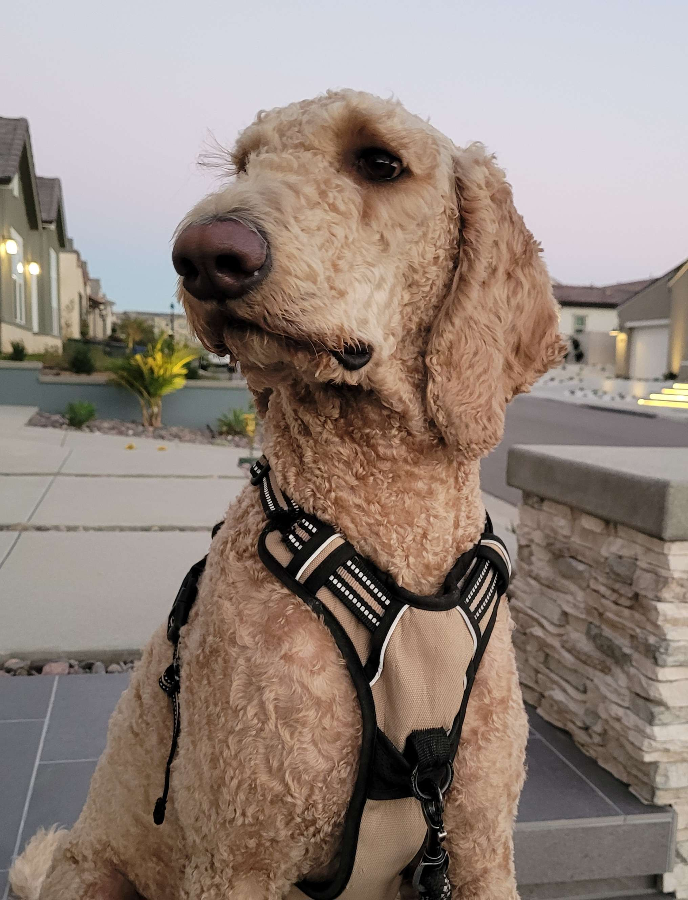

## Build you Home Page here 
This is about your journey. Start now!!!
Go to my [Github account](https://github.com/YeongsuKimm) !!
 

<!-- ## Overview of Hacks, Study and Tangibles
Blogging in GitHub pages is a way to learn and code at the same time. 

- Plans, Lists, [Scrum Boards](https://clickup.com/blog/scrum-board/) help you to track key events, show progress and record time.  Effort is a big part of your class grade.  Show plans and time spent!
- [Hacks(Todo)](https://levelup.gitconnected.com/six-ultimate-daily-hacks-for-every-programmer-60f5f10feae) enable you to stay in focus with key requirements of the class.  Each Hack will produce Tangibles.
- Tangibles or [Tangible Artifacts](https://en.wikipedia.org/wiki/Artifact_(software_development)) are things you accumulate as a learner and coder.  -->

<!-- ## MY PAGE -->
<h1>Hello, Welcome to my page!</h1>

<h2 style="padding-left:2em">About Me:</h2>

    
    <ol style="font-size:15px">
        <li>I was born in South Korea</li>
          
        <li>I have a dog   </li>
           
        <li>I like music <h6>My favorite song</h6><iframe width="280" height="157" src="https://www.youtube.com/embed/ApXoWvfEYVU?si=ihJEORpFZOx7Ik2k" title="YouTube video player" frameborder="0" allow="accelerometer; autoplay; clipboard-write; encrypted-media; gyroscope; picture-in-picture; web-share" allowfullscreen></iframe></li>
         
        <li>I play the violin<h6>My favorite violin piece</h6><iframe width="280" height="157" src="https://www.youtube.com/embed/UFl9xuYP5T8?si=8upDj8Is4BhNkky7" title="YouTube video player" frameborder="0" allow="accelerometer; autoplay; clipboard-write; encrypted-media; gyroscope; picture-in-picture; web-share" allowfullscreen></iframe></li>
         
        <li>I enjoy coding </li>
    </ol>

   
<button class="todo_button" onclick="createItem()">Create a to-do item</button>
<h1>To-do List</h1>
<ol id="to-do">
    <li>Make to-do items permanent</li>
</ol>

<html>
    <head>
        
    </head>
    <body>
        
    </body>
</html>

