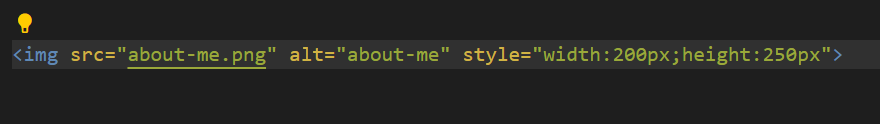
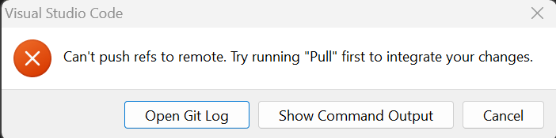
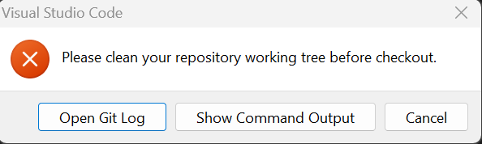
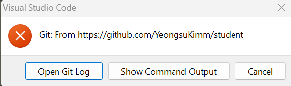

<h1>Hacks</h1>
<ul>
    <li></li>
</ul>
<h1>Notes</h1>
<ul>
    <li>cd changes directories</li>
    <li>Do the hardest task first</li>
    <li>Take a Break to Solve a problem</li>
    <li>Have an outline of desired code (pseudocode)</li>
    <li>Make code rememberable (comments, meaningful variables)</li>
    <li>Markdown translates into HTML code</li>

</ul>
<h1>Fixed Errors</h1>
<ul>
    <li style="font-size:15px">
        Image wasn't rendering in: 
         
          
        Fix:  
        <h4>Fixed the directory</h4>
        
    </li>
     
    <li>
        Make isn't working 
        Fix: 
        <h4>Comment out line 7 in file 'Makefile'</h4>
    </li>
     
    <li>Custom Theme isn't saving on local server
         
        Fix:
        <h4>Make new local server to save changes</h4>
    </li>
</ul>
<h1>Ongoing Errors</h1>
<ul>
    <!-- <li>git pull Error 
        
    </li> -->
     
    <li>push error
         
            
    </li>
     
    <li>pull error happens after push error above 
        
    </li>
         
    <li>sync error 
        
    </li>
</ul>

<!-- 
<h1>To-do</h1>
<html>
    <head>
    </head>
    <body>
        
    </body>
</html> -->
